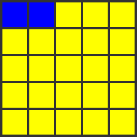

# (What is) PixelArt👾?

[](https://github.com/immmdreza/pixelart/actions/workflows/rust.yml)

[](https://docs.rs/pixelart)

Code to pixel image! This is what this library dose at the moment.


**Made by pixelart 👾** _([This is how](src/pixels/canvas/templates/alien_monster.rs))_.

## Why?

The very first-stone purpose of this lib is to somehow visualize what your code
dose for maybe learning and understating purposes, and of course having fun!

As I already used a lot in tests, If the generated pixel image seems right, you can confirm that your code is also working right. That's one of the _"learning and understating purposes"_, I mentioned before.

We map a simple **fixed size** 2D array of pixels to pixels on a real image. So you
can generate image and see how it changes based on what you do with that array.

## How?

Simply!

### Quick example

Take a look at the example below:

```rust
// Let the fun begins ...
use pixelart::prelude::*;

pub fn main() {
    // A 5x5 pixel canvas.
    let mut canvas = PixelCanvas::<5>::default();

    // mutably access the pixel at the center.
    let center_pixel = &mut canvas[CENTER];
    // Change its color to blue.
    center_pixel.color = BLUE;

    // Create and save image based on the canvas.
    canvas.default_image_builder()
        .with_scale(5)
        .save("my_first_art.png")
        .unwrap();
}
```

This will be the result.


### Breakdown

Let's break down and see what happened though it must be clear enough.

1. Create a default `PixelCanvas`.

    The `PixelCanvas` is a wrapper over so called _"fixed size 2D array of pixels"_.
    The inner type is a `PixelTable` which is an array of `PixelRow` which is an array what? you guess.

    This _some sort of fish_ syntax `::<5>` indicates the size of our array. A 2D array
    has a height (`H`, rows count) and a width (`W`, columns count).

    In this case we set `H` to `5`, which implicitly sets `W` to `5` if you don't set
    that explicitly. So it's equivalent to `::<5, 5>` (`::<H, W>`).

    You could for example do something like this:

    ```rust
    // ---- sniff ----

    // A 3x5 pixel canvas.
    let mut canvas = PixelCanvas::<3, 5>::default();

    // ---- sniff ----
    ```

    The result will be:

    

2. Accessing the pixel at the center.

    You can index into canvas using positions (a combination of row and column of a pixel). In this case we use `StrictPositions` enum which can magically generate
    positions based on canvas size. `CENTER` or `StrictPositions::Center` is center position (`2, 2`).
    The good thing about strict positions is that they can't go out of range!

    `&mut` means I need mutable access to the pixel to change its color, otherwise i can't.

    And the we can change color property of the pixel to `BLUE` or `PixelColor::BLUE`.

3. Generating image.

   The last part in to generate image. We first get the image builder based on canvas
   and then we scale it up a bit (`.with_scale`), to make it more visible.

   And jesus please save me as png (With respect).

You can do many other things like iterating over rows and pixels, creating templates and more ...

### More?

The library aims to provide more method and type to make your life easier, some of these functionalities are:

1. Using `MaybePixel` instead of `Pixel` in canvas allows us to [Create Templates](examples/src/template.rs).

2. In above examples you can review usage of rust iterables and extension methods.

3. Using [Pen](examples/src/pen.rs) to have fun.

## Pixel Animation

You can create simple animations using a series of pixel images as a gif.

We have made a `create_simple_animation` method that helps getting started. it has a context that made of a canvas and a part of it to move around.

This function automatically captures an image at the end of each frame.

``` rust
// A 2x2 canvas and a 1x1 part of it (a pixel) captured
create_simple_animation::<5, 5, 1, 1>(
    TOP_LEFT, // The initial position of the part inside the canvas
    5, // Scale up the images
    Repeat::Infinite, // Decides the repeat of gif.
    Repeat::Infinite, // number of loops, `Infinite` here means we manually break.
    |ctx| { // Setup your canvas
        ctx.update_body_color(YELLOW);
        ctx.update_part_color(BLUE);
    },
    |i, ctx| {
        if let Some(next) = ctx.part.position().next() {
            ctx.part.copy_to(next); // Copy part pixels to next position (next pixel in row)
            ctx.update_part_color(PixelColor::from_blue(255 - (i as u8 * 10) % 250)); // change part color for the next pixel
            true
        } else {
            false // means not to continue any more.
        }
    },
    |_, _ctx| {}, // do nothing else at the end of each frame
)
.save("arts/animation_0.gif")
.unwrap();
```

### Result

Here's the resulting animation.



## More advanced animations?

You can of course create a bit more advanced animations using `AnimationContext` and `Animated` traits. Take a look at tests at: [animation::layered.rs](src/animation/layered.rs).

Here's the result:


## Viewing?!

You can enable a feature named `viewer` to view images or gifs directly inside a window without saving it. (Thanks to egui)

``` rust
canvas.default_image_builder()
    .with_scale(5)
    .view()
    .unwrap();
```

## Features

- Take out picture outputs in jpg or transparent formats like png (where unused pixels are omitted).


- Save file using a proper format or view them inside multiple windows (viewer feature, like above).
- Create pixel animation (like gifs).
- Layered canvas: to create multi layer canvas and animation.
- Canvas partition: to take control of a part of canvas and make changes on it or moving it.
- Pen: To have a pen like control while drawing.
- Templates: Create templates and use them wherever you want.
- A lot of useful helper types and method:

    - Canvass have fixed positions.
    - So we have strict positions, Like: top left, bottom right and ...
    - Fortunately or Unfortunately, we have super trait rich and flexible api.
    - Helper types and functions to create animations (like what you saw).
    - ...

## Where?

1. For now we're focusing on creating images and make it as smooth as possible. But there're more to do.
2. Generating pixel animations (Most likely).
3. Add some interactivity maybe?! (Not sure about this, must be so hard).

## License

Licensed under the mercy and kindness of GOD.

Please use and help making it more useable (Contribute I mean).

## Next?

Just _Remember to have fun 🍟_.
